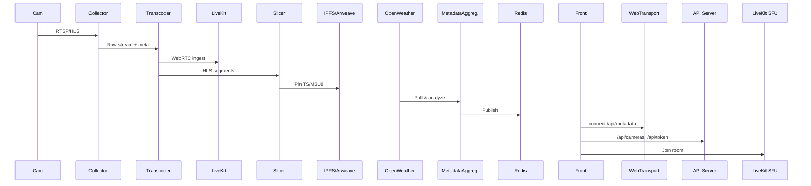

# Backend Architecture Document

## 1. Overview
Web Sensorium Earth フロントエンドの要件を実現するためのバックエンド設計書。
真正性担保、低遅延ストリーミング、多感覚データ提供、およびセッション管理をマイクロサービスで実装。

## 2. Goals
- C2PA 署名付きコンテンツのエンドツーエンドパイプライン
- LiveKit SFU へのリアルタイムストリーム供給 + HLS フォールバック
- 天気・SNS 感情データを 1Hz で配信（WebTransport）
- カメラリスト、トークン発行、ユーザセッション API
- Provenance 保存 (IPFS + Arweave)、メタデータ管理 (Redis, PostgreSQL)

## 3. Tech Stack
| コンポーネント       | 言語／ライブラリ                         |
|----------------------|---------------------------------------|
| Collector            | Node.js / TypeScript                  |
| Transcoder/Slicer    | FFmpeg, c2pa-node, Node.js            |
| SFU                  | LiveKit (Go)                          |
| Metadata Aggregator  | Node.js / Python, Redis Pub/Sub       |
| WebTransport Server  | Node.js (@microsoft/webtransport)     |
| API Server           | Express or Fastify (TypeScript)       |
| DB                   | PostgreSQL                            |
| Cache                 | Redis                                  |
| ストレージ           | IPFS, Arweave                         |
| Orchestration        | Kubernetes, Helm, Terraform           |
| CI/CD                | GitHub Actions, Docker, Helm Charts   |

## 4. ディレクトリ構成案
```plaintext
/backend
  /collector
    index.ts, Dockerfile
  /transcoder
    index.ts, Dockerfile
  /slicer
    index.ts, Dockerfile
  /livekit-token
    tokenService.ts, Dockerfile
  /metadata-aggregator
    index.js, Dockerfile
  /metadata-server
    webtransport.ts, Dockerfile
  /user-session
    src/app.ts
    src/routes/cameras.ts
    src/routes/sessions.ts
    src/routes/token.ts
    src/db.ts
    Dockerfile
  /common
    config.ts, logger.ts
  /charts
    helm/
  /terraform
    main.tf
  docker-compose.yml
```

## 5. マイクロサービス概要

### 5.1 Collector Service
- 公開 Web カメラ (RTSP/HLS) をポーリング
- 映像 + メタデータを Transcoder に送信 (HTTP or Kafka)

### 5.2 Transcoder & C2PA Signing
- FFmpeg GPU トランスコード → AV1/Opus
- c2pa-node でフレーム署名
- LiveKit ingest エンドポイントへ送信
- Slicing Service へも同時配信

### 5.3 Slicer Service
- HLS v4 マニフェスト・セグメント生成
- IPFS + Arweave に .ts/.m3u8 をピン留め
- CDN 配信用に公開

### 5.4 LiveKit SFU
- ライブストリームをフロントへ WebRTC 経由で提供
- Simulcast & スケーリング

### 5.5 Metadata Aggregator
- OpenWeather, SNS API からデータ取得
- Sentiment ML 処理
- Redis Pub/Sub でデータ発行
- WebTransport 非対応ブラウザ向け: HTTP/2 SSE or WebSocket フォールバック

### 5.6 WebTransport Server
- `/api/metadata?cameraId=` で WebTransport over HTTP/3 提供
- 1Hz の JSON チャンク配信

### 5.7 User Session & Token API
- GET `/api/cameras`: カメラ一覧・位置・視点初期値 (IP制限/APIキーによるレート制御)
- POST `/api/sessions`: ユーザセッション生成
- GET `/api/token?cameraId=`: LiveKit トークン発行 (JWTスコープ必須)
- PostgreSQL にカメラ設定・セッション保存

## 6. データフロー


## 7. デプロイ & CI/CD
- GitHub Actions: lint, type-check, Docker build, Helm deploy
- モニタリング: Prometheus, Grafana, Loki を Helm charts に追加
- ストレージキャッシュ: Cloudflare R2 24h キャッシュ設定
- コード品質: ESLint, Prettier, Commitlint を CI に組み込み
- Kubernetes クラスター (GPU ノード含む)
- Terraform 管理のインフラ

## 8. 今後の拡張
- グループセッション同期コントローラ
- 感情ヒートマップ生成サービス
- API ドキュメント (OpenAPI/Swagger)
